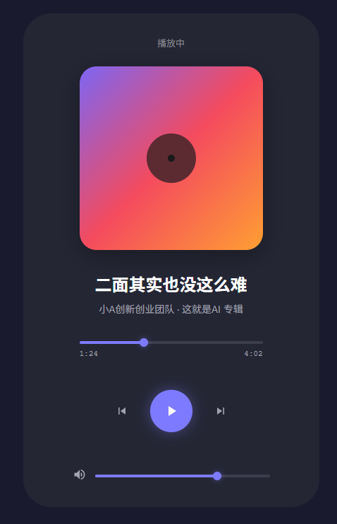
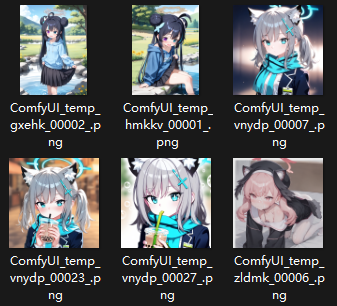
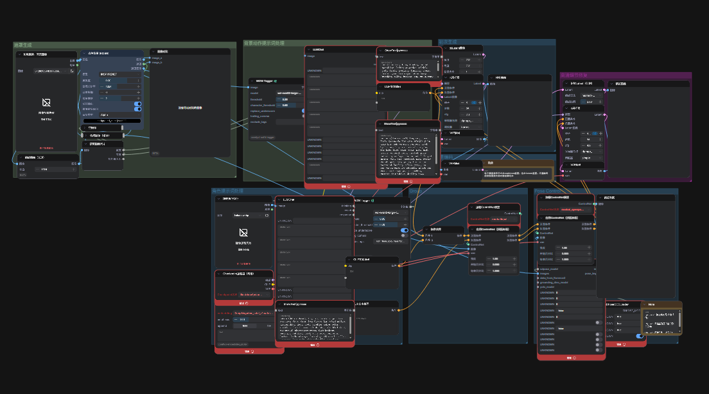
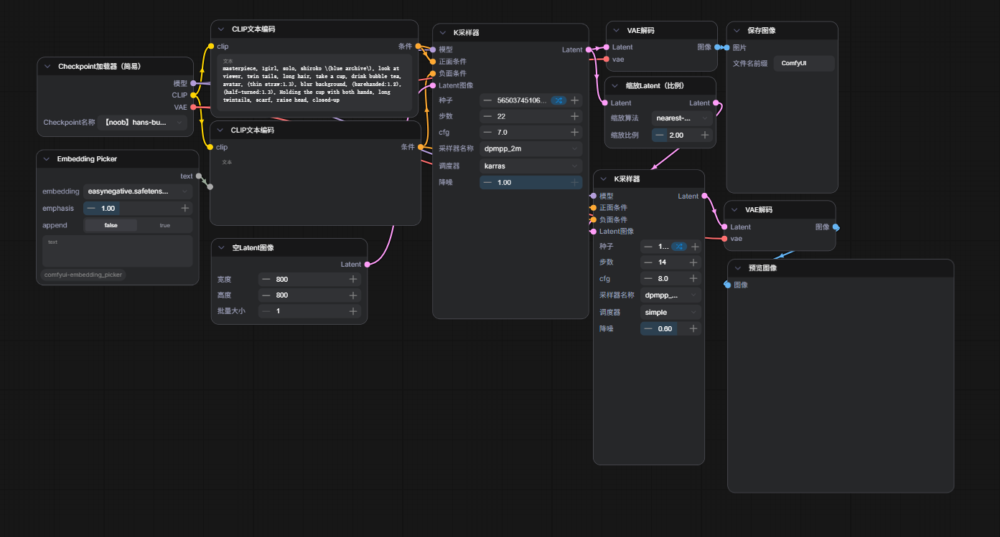

# Aplus 考核任务2

## 项目结构说明
- README.md 标准项目说明文件
- 任务说明.md 任务完成详情文件
- libs/ 每个代码类任务都有一个子目录，用于存放该子项目的代码
  - Aplus2-GenerateInterface/ 音乐播放页面生成
  - Aplus2-simpleRAG/ 简单RAG系统
  - Aplus2-convertLLaMA/ 转换LLaMA模型
  - Aplus2-runModelInTransformer/ 在Transformer中运行模型
  - Aplus2-runModelInvLLM/ 在vLLM中运行模型
- pictures/ 截图目录
- docs/ 文档目录


## 任务完成详情

### 2.1 音乐播放页面生成
[仓库地址](https://github.com/CelestNya/Aplus2-GenerateInterface)


最终提示词（其实更像spec）：[页面生成提示词](libs\Aplus2-GenerateInterface\prompt.md)

说来惭愧，一开始没有正确识别任务要求，是把图丢进去了的，哪怕这样也只能仿照个7分像。
中途玩心重，又想办法把这个页面做成功能完整的播放器，其实是做出来了的，但是后面看到任务要求又删了。所以这个任务完成的一般。（期间还试着去ai生音乐，趁着minimax限免，但是生成好几次都觉得好难听，也试了下sunoai，5毛一次有点花不起，最后也没有得到满意的成品）
做这个最大的心得就是试了试各家ai的识图能力，发现vlm可能能理解到图片，但是难在他们写的代码不太能准确复刻，特别是间距大小问题尤为严重，对颜色反而比较敏感。

生成页面效果：



### 2.2.1 简单RAG系统

[仓库地址](https://github.com/CelestNya/Aplus2-simpleRAG) | [项目介绍](libs\Aplus2-simpleRAG\README.md)

实现了简单的RAG系统，包括文档摄入、查询、基于api的ai对话查询等功能。

#### #实践
使用的模型是`Qwen3-Embedding-0.6B`，对大小写及其敏感。
原始输出：[simpleRAG_run.md](docs\simpleRAG_run.md)
```sh
uv run main.py query ChatGPT是一个关键的产品 --top 3 --no-post-process
```

该命令规定其使用模型原始输出，而不经过后处理。查询结果如下：
```sh
[1] (distance: 0.6612)
    Source: documents\应用方向-任务2文本-选项一.txt
    Content: ChatGPT的推出标志着AI的一个关键时刻，通常被称为ChatGPT时刻(ChatGPT moment)，因为它展示了对话式AI改变人机交互的潜力。

[2] (distance: 0.6612)
    Source: documents\应用方向-任务2文本-选项一.txt
    Content: ChatGPT的推出标志着AI的一个关键时刻，通常被称为ChatGPT时刻(ChatGPT moment)，因为它展示了对话式AI改变人机交互的潜力。

[3] (distance: 0.6913)
    Source: documents\应用方向-任务2文本-选项一.txt
    Content: ChatGPT基于GPT-3.5和InstructGPT，OpenAI于2022年11月推出了ChatGPT，这是一种突破性的对话式AI模型，专门为自然的多轮对话进行了微调。ChatGPT的关键改进包括：
```

由于使用了多重分块，因而容易产生重复块，需要在后续处理中进行去重。


**理解：** embedding是将文本转换为向量表示。模型就是其中的大量变换矩阵，让语义可以映射到向量空间中。（会不会有点像transformer的编码器？）


### 2.2.2 ComfyUI跑图
这个我算是入门挺久了，目前controlnet玩的挺溜。但是由于性能限制，flux和训练lora都还没有尝试过，还试过用wan2.2花2个小时生成5秒钟无意义伪人视频。

#### 能放出来的图片一角，包括我的微信头像也是自己跑的


由于大部分是在家里玩的，学校电脑刚配的环境只能跑简单的工作流，复杂一点的工作流加了好多插件需要我自己去处理依赖，所以暂时没办法展示其运行效果了。（如下图）



以下是我用于生成白子喝奶茶的工作流，比较简单


效果图（使用hans-bulldonzer模型）:


可爱捏ww，换个模型试试（miaomiaorealskin，容易过锐需要适当拉低cfg）

这个模有点风格化，不是谁都喜欢这个风格，而且由于训练集可能比较少，很多动作下容易出现肢体错误，需要抽好久卡才能得到满意的结果。

### 2.2.3 各种姿势跑LLM

- 2.2.3.1 在Transformer中运行模型
  
    [项目说明](libs\Aplus2-runModelInTransformer\README.md) | [项目地址](https://github.com/CelestNya/Aplus2-runModelInTransformer)

    优势：依赖transformers库，代码结构比较简单，平台兼容性较好。

    问题：但是vl之类的还是可能出现依赖装不上、没有对应版本的问题。目前该代码只能跑原生模型且只能进行文本输出，输入awq、gptq等量化都会报错(依赖难以正确处理)。

    
    


- 2.2.3.2 在vLLM中运行模型
  
    [项目说明](libs\Aplus2-runModelInvLLM\README.md) | [项目地址](https://github.com/CelestNya/Aplus2-runModelInvLLM)

    优势：并发性能强劲，支持批量推理，支持所有主流的量化格式。

    问题：linux强依赖，冷启动时间超长，预分配显存导致内存占用高。


- 2.2.3.3 转换LLaMA模型,并使用LLaMA.cpp运行
    
    [转换脚本项目说明](libs\Aplus2-convertLLaMA\README.md) | [转换脚本项目地址](https://github.com/CelestNya/Aplus2-convertLLaMA)

    llama.cpp使用预先编译好的 [LLaMa](https://github.com/ggml-org/llama.cpp)

    优势：即装即用，效果尚可

    问题：不灵活需要编译后运行，只能跑gguf格式模型


### 3. 试阅 Attention is All You Need 心得
    
